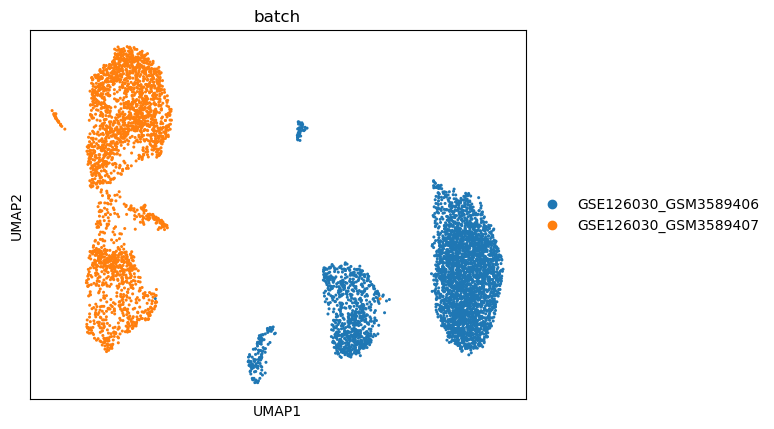
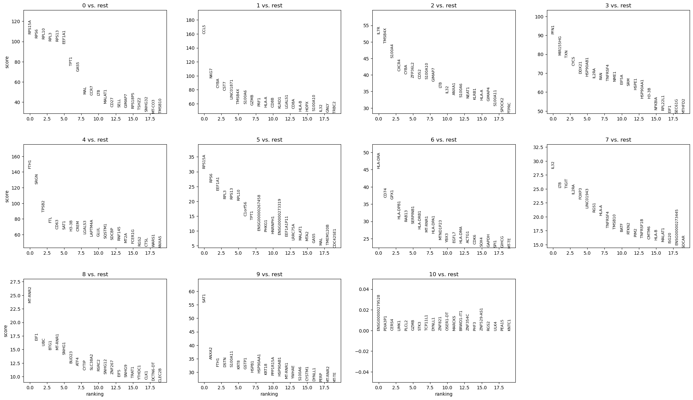
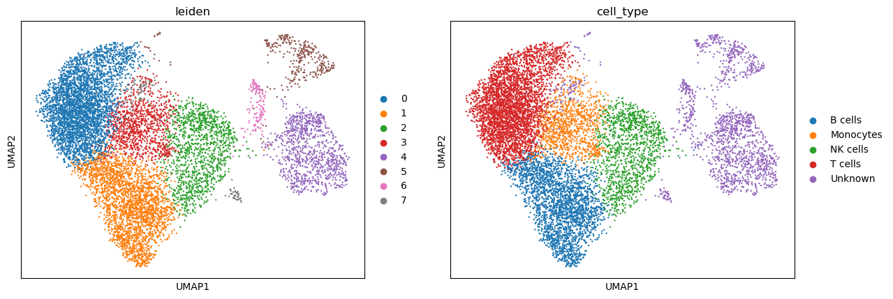
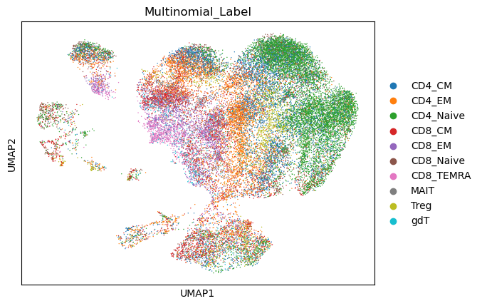
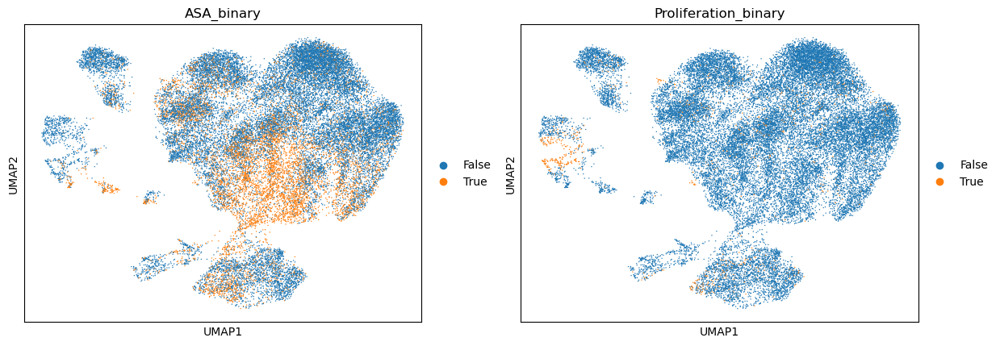

---

## 🚀 Workflow Overview

1. **Data Download & Conversion**  
   - GEO datasets are downloaded using `GEOparse`.  
   - Dense matrices (`matrix.txt.gz`) and 10X-style matrices (`matrix.mtx.gz`) are converted into `.h5ad` files.  
   - Metadata is saved as CSVs.

2. **Preprocessing & Integration**  
   - Individual `.h5ad` datasets are normalized, log-transformed, and filtered.  
   - Ensembl IDs are converted to gene symbols.  
   - Datasets are concatenated into a combined AnnData object.  
   - Batch correction performed with **Harmony**.  
   - PCA, neighbor graph, and UMAP are computed.

3. **Clustering & Manual Annotation**  
   - Leiden clustering applied.  
   - Marker genes identified and plotted.  
   - Clusters mapped to immune cell types (T, B, NK cells, monocytes, etc.).

4. **Automated Annotation (starCAT)**  
   - starCAT used to compute gene usage profiles and scores.  
   - Multinomial and binary activation/proliferation states annotated.  
   - UMAP plots generated for automated labels.

---

## 📊 Key Figures

- **UMAP after Harmony batch correction**  
  

- **Marker genes per Leiden cluster**  
  

- **Annotated UMAP (manual cell types)**  
  

- **starCAT multinomial labels**  
  

- **starCAT binary activation/proliferation labels**  
  

---

## 💾 Outputs

- Processed datasets: `data/processed/*.h5ad`  
- Metadata: `data/meta/*.csv`  
- Integrated dataset: `adata_combined_combat.h5ad`  
- Annotated dataset: `adata_annotated.h5ad`  

---

## 📌 Notes

- All plots are generated automatically by the pipeline and saved in `src/figures/`.  
- Selected final figures are copied to the top-level `figures/` directory for presentation and reporting.  

---

